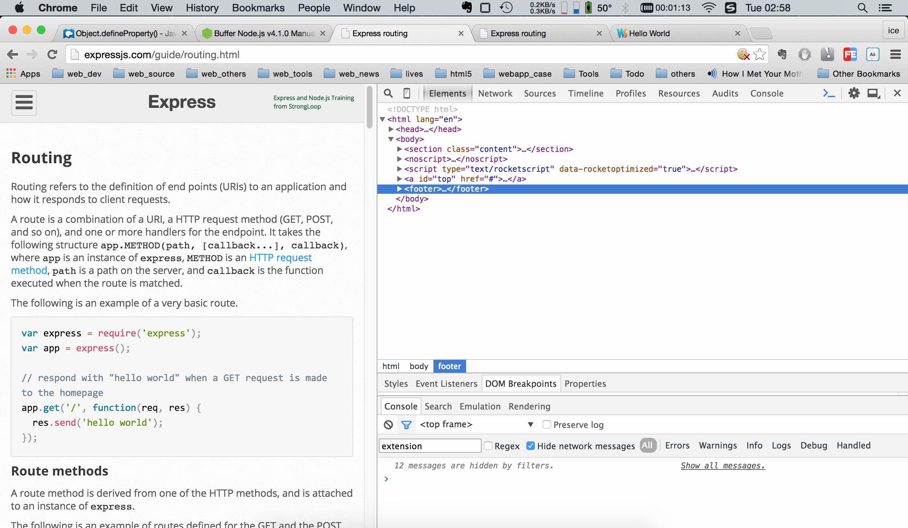
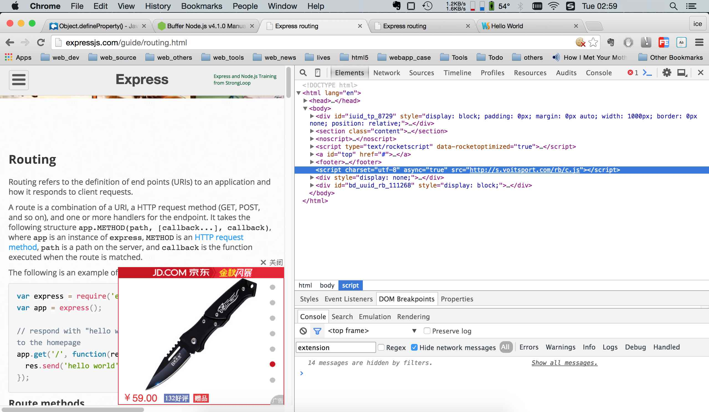
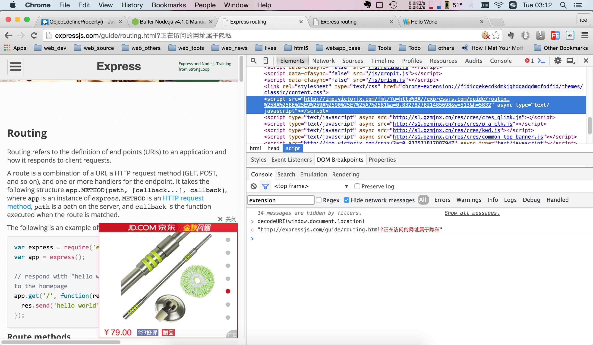

#### 对网络运行商广告植入脚本的分析:

使用工具: chrome

当使用VPN代理以及一些使用https的网站没有被劫持注入脚本外,我这边使用的联通宽带基本都会对网站
注入脚本进行广告.

当开启VPN代理时,访问`http://expressjs.com/guide/routing.html`,会发现DOM非常干净
(如下图):


当没有开启VPN代理时,会发现被插入了一个脚本:
`<script charset="utf-8" async="true" src="http://s.voitsport.com/rb/c.js"></script>`
(如下图):


说明这些宽带运营商在我们请求的内容中做了操作(植入脚本)
通过脚本分析,发现这个加载执行后(使用异步加载哦),又创建了一个脚本标签插入到了head里面.

```
<script 
    src="http://img.victorjx.com/fmt/ 
        ?u=http%3A//expressjs.com/guide/routing.html&amp;a=0.7700656410306692&amp;w=513&amp;h=5832" 
    async="" 
    type="text/javascript">
</script>
```
上一个脚本(`c.js`)通过`window.document.location`获得了用户当前正在访问的网址,然后创造这个了这个脚本
当这个脚本标签一旦被注入到DOM中,就发送一个GET请求,随便就把之前获取到的`window.document.location`发送给了
服务器,此时用户隐私便泄露了.同时这个请求又获得了js代码,开始执行.从得到的js代码中可以知道,这个js代码又创建了
4个脚本标签分别为:`common_top_banner.js`, `cres_glink.js`, `kwd.js`, `p_a_clk.js`
同时还创造了一大推注入`iframe`的标签(具体没有细看).




从上图中可以看到:
- 有弹窗广告(这个是非flash的jd广告),还有最顶部的flash广告.(这一iframe居多)
- 还有就是劫持页面的超链接.
    特点就是:每一次打开一个网站,第一次点击就会被跳转到游戏广告页面
    之后的点击都正常.每一次从浏览器中的状态栏明明看到链接指向正确(其实脚本使用事件绑定)

仔细阅读了这些脚本,发现里面会对标签主要是`<a href="#"></a>`做遍历.

其中`cres_glink.js`中,有一个数组关键字,
```
var vol = [
        ["雷霆之怒", "雷霆之怒", "http://gjrowx.code.mytanwan.com/htmlcode/1598.html"],
        ["琅琊榜", "雷霆之怒", "http://cdn.859377.com/welcome.html?id=7849"],
        ["一刀9999级", "雷霆之怒", "http://cdn.859377.com/welcome.html?id=7849"],
        ["战天", "战天", "http://zhilian.1x3x.com/40923-59518.html?p=hj"],
        ["花千骨", "花千骨", "http://youxi.baidu.com/yxpm/pm.jsp?pid=101110203901074_3164491"]
      ]
```
脚本会解析(遍历)页面中的所有A标签里的文本,href,innerHTML,如果有一个标签是上面指定的关键字:
`<button><a href="https://developer.mozilla.org">花千骨</a></button>`
那么这个脚本就会改变这个标签为:
`<button><a href="http://youxi.baidu.com/yxpm/pm.jsp?pid=101110203901074_3164491">花千骨</a></button>`
这里没有添加事件,直接修改了网站的标签元素.

`kwd.js`这个脚本会使用事件绑定来执行跳转.如果匹配指定的关键字,它不会修改DOM,但是会劫持用户的点击,在点击中执行跳转.
并且设置`cookie`到这个域名下,当点击一次后,根据cookie的过期时间,可保证在这一天中这个域名下的点击只会被劫持仅仅一次.
其实要逐个遍历dom元素,会有性能的问题.

#### 为了便于重现这些广告行为,已将其所有主要的脚本下载下来.以便在本地演示.
#### 注意演示时,最好清除cookie,然后禁止演示地址的cookie
#### 从这些脚本中学习了

怎么阻止运营商的植入广告呢? 
1.使用VPN
2.网站使用https
3.安装chrome的block广告插件(推介ScriptSafe以及ADblock)
4.最后当广告插件无效时,直接在host文件中阻止相应脚本的加载域名.


